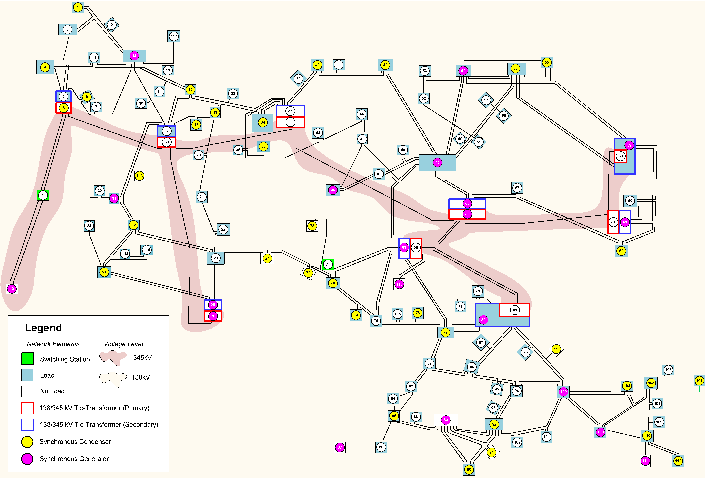

# Machine Learning Datasets and Models for Grid Health Index Prediction Using Graph Attention (GAT) Models


## Table of Contents
1. [Key Features](#key-features)
2. [Repository Overview](#repository-overview)
3. [Getting Started](#getting-started)
    - [Prerequisites](#1-Prerequisites)
4. [Results and Reproducibility](#results-and-reproducibility)
    - [Power Flow Snapshot](#1-Power-flow-snapshot)
    - [Detailed Testing Procedure](#2-Detailed-testing-procedure)
5. [Contributing](#contributing)
6. [License](#license)
7. [Acknowledgments](#acknowledgments)
8. [Contact](#contact)
 
---

## Key Features
This repository includes:
- Training and testing datasets
- 25,225 power flow snapshots [^1]
- Dynamic simulation results were generated at 40% load with both even and uneven generation dispatches, and at 100% load with no dispatch adjustment required.[^2]
- Graph attention network models for frequency/angle health index
- Python code for evaluating frequency/angle health index
[^1]: Nodes are augmented to explicitly implement step-up and step-down transformers.
[^2]: Results at other load conditions (45, 50, ... 95%) are available upon request. Please email me [#Contact](#contact) for further inquiries.

## Repository Overview
This repository provides datasets, power flow snapshots, and dynamic simulation results at 40% and 100% load conditions. It includes pre-trained models using Graph Attention Networks (GAT) for frequency/angle health index prediction and Python code for evaluating these health indices. The codebase is intended for researchers and practitioners working on grid health monitoring and network analysis.

## Getting Started
### Prerequisites
- Python 3.10 or later
- PyTorch 2.0.1 or later
- PyTorch Geometric 2.3.0 or later
- 48 GB or more GPU memory is recommended when training the model.

## Results and Reproducibility
Python codes for the testing are available under \AllDataset\TestingOnly\.
There are two Python codes for the frequency health index and angle health index.

### Power Flow Snapshot
- The impedance data is available [here](AllDataset/PowerFlowSnapshot/SystemData.txt). Note that all data are based on per unit with 100 MVA base.
- Power flow results are available [here](AllDataset/PowerFlowSnapshot/PowerFlowSnapshot.7z). 

### Detailed Testing Procedure
#### Frequency Health Index
The Python code allows users to specify:

- Imputation methods (using `--imp`): 0 for zero imputation, 1 for peak value replacement, 2 for pseudo-PMU measurement.
- Ordinal encoder usage (using `--enc`): `Y` for with ordinal encoder, `N` for without ordinal encoder.
- Error percentage when the pseudo-PMU measurement method is employed (using `--per`): a range between 0 and 100.


These settings can be reflected using the argument of the Python code when running.
For example, when selecting the pseudo-PMU measurement method with the error percentage of 1\%, please type:

```python GAT500.py --imp 2 --mdl GAT --enc Y --per 1```

Currently, only GAT models are available on \AllDatset\OffTheShelfModel.

So, *"--mdl GAT"* is  (GAT stands for the use of Graph attention network model) 

Please ensure the order of these arguments. The code does not work when the order is different.

## Contributing
Thank you for your interest in improving this work! If you have ideas or suggestions:

Fork the repository and experiment with the code.
Submit a pull request if you'd like to share your updates or fixes.
I appreciate your effort in making this task better, no matter how small the contribution.

## License
You are free to use this code without any restrictions. However, if you utilize the training dataset, please cite this repository in your work.

## Acknowledgments
This code was developed with sponsorship from the Electric Power Research Institute under agreement 10015026.

## Contact
For further contact, email kyamashi@ucr.edu and koji.yamashita.jp@ieee.org
